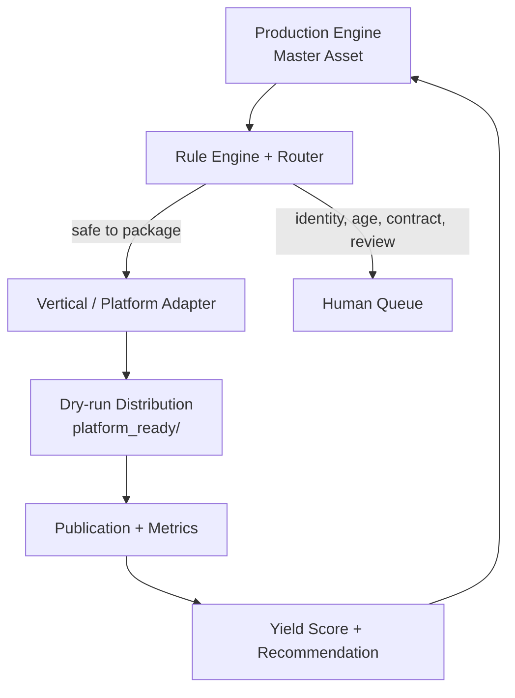
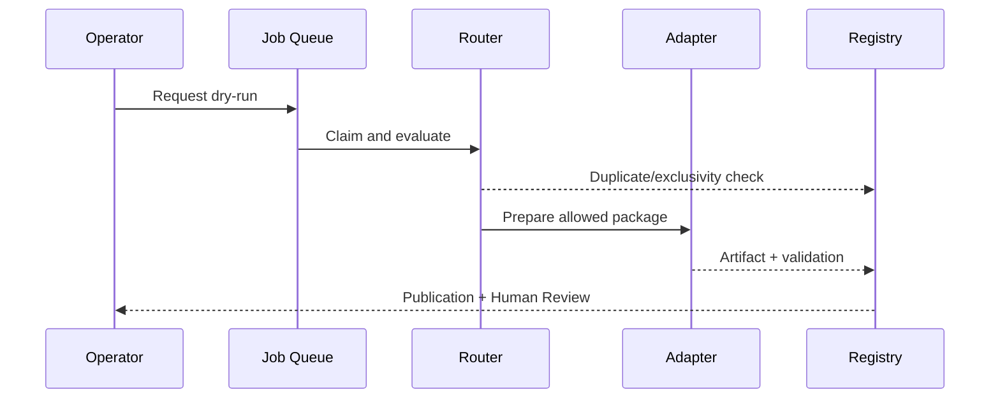

# Architecture

Distribution OS V1 is a modular monolith. One process owns policy routing, a durable SQLite queue, adapters, analytics, and the operator API. This keeps local operation cheap while preserving replaceable boundaries.

## Boundaries

| Boundary | Owns | Must not own |
|---|---|---|
| Core | models, gates, hashes, scores, state transitions | marketplace SDK details |
| Registry | versioned vertical/platform/rule/asset/variant/account facts | raw credentials |
| Adapter | platform format and validation differences | global portfolio policy |
| Distribution service | orchestration and audit | hidden live shortcuts |
| Transport | HTTP/API/UI | business rules |
| Human Queue | manual decisions and regulated steps | automatic bypasses |

## Execution sequence

## Storage

SQLite tables store explicit query keys plus JSON payloads for evolvable records. A `Variant` is the immutable platform-adapted artifact between an `Asset` and a `Publication`; a `RuleRecord` is the versioned evidence snapshot behind a platform decision. WAL mode, foreign keys, transactional job claims, unique idempotency keys, and unique publication identities provide the V1 reliability floor. The repository layer can later be reimplemented for PostgreSQL without changing adapters.

## Deployment shape

The base runtime has no third-party dependency and serves the Dashboard with Python's `ThreadingHTTPServer`. Installing the `web` extra enables FastAPI and OpenAPI. Both transports call the same core application; neither can enable real publishing.

## Extension rule

- New product: create an `Asset`; do not modify core.
- New platform: add Platform Config plus one adapter; core should remain unchanged.
- New vertical: add Vertical Config and only the vertical transformation logic that is genuinely new.
- Changed policy: update Registry evidence and rule version.
- Changed package format: update the relevant adapter version.
